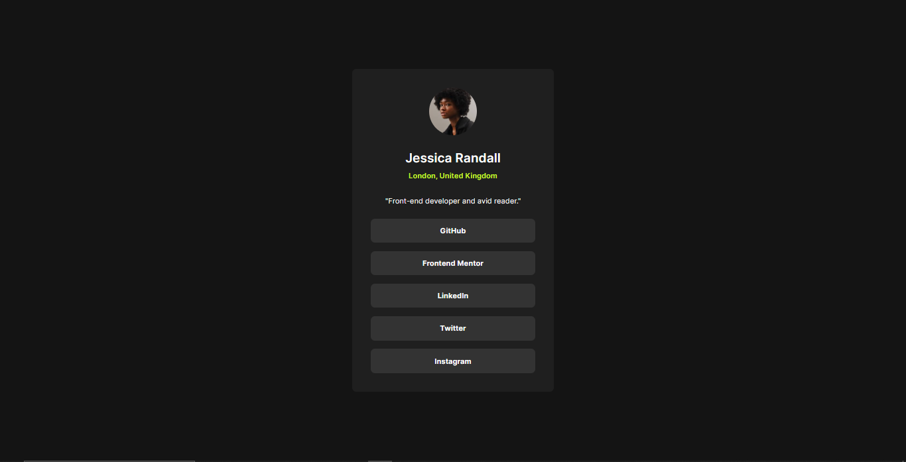

# Social links profile solution

This is a solution to the [Social links profile challenge on Frontend Mentor](https://www.frontendmentor.io/challenges/social-links-profile-UG32l9m6dQ). Frontend Mentor challenges help you improve your coding skills by building realistic projects. 

## Table of contents

- [Overview](#overview)
  - [Screenshot](#screenshot)
  - [Links](#links)
- [My process](#my-process)
  - [Built with](#built-with)
  - [Useful resources](#useful-resources)

## Overview

### Screenshot

### Links

- Solution URL: [Add solution URL here](https://github.com/alan-mesquita/social-links-profile)
- Live Site URL: [Add live site URL here](https://social-links-profilee.vercel.app/)

## My process

### Built with

- Semantic HTML5 markup
- CSS custom properties
- CSS Grid
- Mobile-first workflow

### Useful resources

- [PerfectPixel by WellDoneCode](https://microsoftedge.microsoft.com/addons/detail/perfectpixel-by-welldonec/oolfkllppnieaaddmlfgljpboeagcobk?hl=pt-PT) - This is a very good extension that helped me get as close to the current layout without having the figma file.